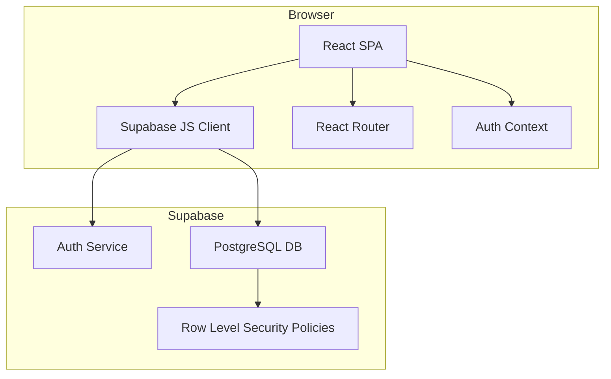
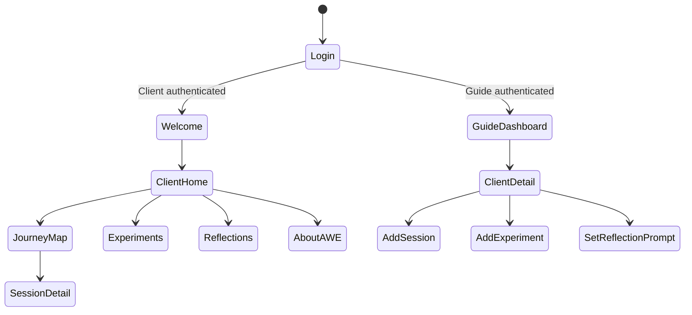

# Design Document: AWExApp Coaching Companion

## Overview

AWExApp is a mobile-first coaching companion web application built with React and Supabase. It supports two user roles — a **Guide** (coach) and **Clients** — and implements the AWE (Awareness, Wonder, Embodied Alignment) coaching methodology.

The app is a single-page application (SPA) delivered as a static HTML/JS/CSS bundle. The existing prototype (`index.html`) demonstrates the visual design system and screen layout. The production implementation will migrate this prototype into a React component architecture backed by Supabase for authentication, data persistence, and row-level security.

### Key Design Goals

- Mobile-first layout (320px–480px viewport), matching the existing prototype's visual design system
- Two distinct authentication flows: Client (name + access code) and Guide (email + password via Supabase Auth)
- Real-time data persistence via Supabase with row-level security ensuring clients can only access their own data
- Minimal, calm UX consistent with the AWE coaching philosophy

### Technology Stack

- **Frontend**: React 18 + Vite, React Router v6
- **Styling**: CSS Modules or plain CSS (matching existing design tokens from prototype)
- **Backend**: Supabase (PostgreSQL + Auth + Row Level Security)
- **State Management**: React Context + `useState`/`useEffect` (no external state library needed at this scale)
- **Deployment**: Static hosting (Netlify / Vercel)

---

## Architecture

The application follows a client-server architecture where the React SPA communicates directly with Supabase via the `@supabase/supabase-js` client library.



### Authentication Architecture

Two separate authentication flows share the same login screen:

- **Client login**: Looks up the `clients` table by `name` + `access_code`. On match, creates a Supabase anonymous/custom session or uses a stored JWT. The client's `id` is stored in React context and `localStorage` for session persistence.
- **Guide login**: Standard Supabase email/password auth (`supabase.auth.signInWithPassword`). The Guide's session is managed entirely by Supabase Auth.

> **Design Decision**: Client authentication does not use Supabase Auth (which requires email). Instead, client identity is validated by querying the `clients` table and storing the matched client record in `localStorage`. A short-lived signed token (or simply the client UUID) is stored to persist the session across page refreshes.

### Screen Flow



---

## Components and Interfaces

### Component Tree

```
App
├── AuthProvider (context)
├── Router
│   ├── LoginScreen
│   │   ├── ClientLoginForm
│   │   └── GuideLoginForm
│   ├── WelcomeScreen
│   ├── ClientLayout (persistent bottom nav)
│   │   ├── HomeScreen
│   │   ├── JourneyMapScreen
│   │   │   └── SessionDetailScreen
│   │   ├── ExperimentsScreen
│   │   ├── ReflectionsScreen
│   │   └── AboutAWEScreen
│   └── GuideDashboard
│       ├── ClientListScreen
│       └── ClientDetailScreen
│           ├── SessionForm
│           ├── ExperimentForm
│           └── ReflectionPromptForm
```

### Key Interfaces

```typescript
// Auth context shape
interface AuthContext {
  user: ClientUser | GuideUser | null;
  role: 'client' | 'guide' | null;
  signOut: () => Promise<void>;
}

interface ClientUser {
  id: string;
  name: string;
  access_code: string;
}

interface GuideUser {
  id: string;
  email: string;
}
```

### Supabase Client Module

A single `src/lib/supabase.ts` module exports the configured Supabase client:

```typescript
import { createClient } from '@supabase/supabase-js';
export const supabase = createClient(
  import.meta.env.VITE_SUPABASE_URL,
  import.meta.env.VITE_SUPABASE_ANON_KEY
);
```

### Data Access Layer

Each domain area has a dedicated service module:

- `src/services/auth.ts` — client login, guide login, sign out
- `src/services/sessions.ts` — CRUD for sessions and reflection questions
- `src/services/experiments.ts` — CRUD for experiments and experiment logs
- `src/services/reflections.ts` — CRUD for reflection entries and prompts
- `src/services/clients.ts` — Guide-only: list clients, create client, get client detail

---

## Data Models

### Supabase Database Schema

```sql
-- Clients table (managed by Guide, not Supabase Auth)
CREATE TABLE clients (
  id          UUID PRIMARY KEY DEFAULT gen_random_uuid(),
  name        TEXT NOT NULL,
  access_code TEXT NOT NULL UNIQUE,
  created_at  TIMESTAMPTZ DEFAULT now()
);

-- Sessions (created by Guide for a specific Client)
CREATE TABLE sessions (
  id          UUID PRIMARY KEY DEFAULT gen_random_uuid(),
  client_id   UUID NOT NULL REFERENCES clients(id) ON DELETE CASCADE,
  notes       TEXT NOT NULL,
  session_date DATE,
  created_at  TIMESTAMPTZ DEFAULT now()
);

-- Reflection questions attached to a session
CREATE TABLE reflection_questions (
  id          UUID PRIMARY KEY DEFAULT gen_random_uuid(),
  session_id  UUID NOT NULL REFERENCES sessions(id) ON DELETE CASCADE,
  client_id   UUID NOT NULL REFERENCES clients(id) ON DELETE CASCADE,
  question    TEXT NOT NULL,
  created_at  TIMESTAMPTZ DEFAULT now()
);

-- Client responses to reflection questions
CREATE TABLE reflection_responses (
  id              UUID PRIMARY KEY DEFAULT gen_random_uuid(),
  question_id     UUID NOT NULL REFERENCES reflection_questions(id) ON DELETE CASCADE,
  client_id       UUID NOT NULL REFERENCES clients(id) ON DELETE CASCADE,
  response_text   TEXT,
  skip_reason     TEXT CHECK (skip_reason IN ('Need more time', 'Not comfortable', 'Not helpful to my journey')),
  updated_at      TIMESTAMPTZ DEFAULT now(),
  CONSTRAINT one_response_per_question UNIQUE (question_id, client_id)
);

-- Experiments assigned to a client
CREATE TABLE experiments (
  id          UUID PRIMARY KEY DEFAULT gen_random_uuid(),
  client_id   UUID NOT NULL REFERENCES clients(id) ON DELETE CASCADE,
  name        TEXT NOT NULL,
  description TEXT,
  is_active   BOOLEAN DEFAULT true,
  created_at  TIMESTAMPTZ DEFAULT now()
);

-- Daily experiment logs
CREATE TABLE experiment_logs (
  id            UUID PRIMARY KEY DEFAULT gen_random_uuid(),
  experiment_id UUID NOT NULL REFERENCES experiments(id) ON DELETE CASCADE,
  client_id     UUID NOT NULL REFERENCES clients(id) ON DELETE CASCADE,
  log_date      DATE NOT NULL DEFAULT CURRENT_DATE,
  status        TEXT NOT NULL CHECK (status IN ('I did it', 'I forgot', 'Something got in the way')),
  note          TEXT,
  created_at    TIMESTAMPTZ DEFAULT now(),
  CONSTRAINT one_log_per_day UNIQUE (experiment_id, client_id, log_date)
);

-- Free-form journal entries
CREATE TABLE reflection_entries (
  id          UUID PRIMARY KEY DEFAULT gen_random_uuid(),
  client_id   UUID NOT NULL REFERENCES clients(id) ON DELETE CASCADE,
  entry_text  TEXT NOT NULL,
  created_at  TIMESTAMPTZ DEFAULT now()
);

-- Active reflection prompt per client (one at a time)
CREATE TABLE reflection_prompts (
  id          UUID PRIMARY KEY DEFAULT gen_random_uuid(),
  client_id   UUID NOT NULL REFERENCES clients(id) ON DELETE CASCADE UNIQUE,
  prompt_text TEXT,
  updated_at  TIMESTAMPTZ DEFAULT now()
);
```

### Row Level Security Policies

```sql
-- Clients can only read their own record
ALTER TABLE clients ENABLE ROW LEVEL SECURITY;
-- (Guide accesses via service role key; clients use anon key with custom claims)

-- Sessions: clients read their own; guide reads/writes all
ALTER TABLE sessions ENABLE ROW LEVEL SECURITY;
CREATE POLICY "client_read_own_sessions" ON sessions
  FOR SELECT USING (client_id = current_setting('app.client_id')::uuid);

-- Similar policies applied to: reflection_questions, reflection_responses,
-- experiments, experiment_logs, reflection_entries, reflection_prompts
```

> **Design Decision**: Because clients don't use Supabase Auth, RLS policies use a custom session variable `app.client_id` set at the start of each request via a Supabase Edge Function or by passing the client ID as a claim in a custom JWT. Alternatively, the Guide's service role key is used server-side only, and client requests are validated by a lightweight Edge Function that verifies the access code and returns a signed JWT with the client's UUID embedded.

### TypeScript Data Types

```typescript
interface Session {
  id: string;
  client_id: string;
  notes: string;
  session_date: string | null;
  created_at: string;
  reflection_questions?: ReflectionQuestion[];
}

interface ReflectionQuestion {
  id: string;
  session_id: string;
  client_id: string;
  question: string;
  response?: ReflectionResponse;
}

interface ReflectionResponse {
  id: string;
  question_id: string;
  response_text: string | null;
  skip_reason: SkipReason | null;
  updated_at: string;
}

type SkipReason = 'Need more time' | 'Not comfortable' | 'Not helpful to my journey';

interface Experiment {
  id: string;
  client_id: string;
  name: string;
  description: string | null;
  is_active: boolean;
  logs?: ExperimentLog[];
}

interface ExperimentLog {
  id: string;
  experiment_id: string;
  log_date: string;
  status: ExperimentStatus;
  note: string | null;
}

type ExperimentStatus = 'I did it' | 'I forgot' | 'Something got in the way';

interface ReflectionEntry {
  id: string;
  client_id: string;
  entry_text: string;
  created_at: string;
}

interface ReflectionPrompt {
  client_id: string;
  prompt_text: string | null;
  updated_at: string;
}
```

---

## Correctness Properties

*A property is a characteristic or behavior that should hold true across all valid executions of a system — essentially, a formal statement about what the system should do. Properties serve as the bridge between human-readable specifications and machine-verifiable correctness guarantees.*

### Property 1: Credential Verification Correctness

*For any* client record in the database and any submitted (name, access_code) pair, the login function SHALL return a successful match if and only if both the name and access_code match exactly one record.

**Validates: Requirements 1.1**

---

### Property 2: Generic Error Message on Authentication Failure

*For any* invalid credential combination (wrong name only, wrong code only, or both wrong), the error message returned by the login function SHALL be identical — it must not reveal which field was incorrect.

**Validates: Requirements 1.2**

---

### Property 3: Session Persistence Round-Trip

*For any* valid client identity stored to localStorage, reading it back SHALL return an equivalent client identity (same id, name, and access_code).

**Validates: Requirements 1.5**

---

### Property 4: Data Creation Round-Trip

*For any* valid data record created via the service layer (client, session, experiment, reflection prompt, or journal entry), fetching that record by its returned ID SHALL return data equivalent to what was submitted.

**Validates: Requirements 3.1, 4.1, 6.1, 8.1, 9.2**

---

### Property 5: Reverse-Chronological Ordering

*For any* collection of records with `created_at` timestamps (sessions or reflection entries), the list returned by the fetch function SHALL be ordered with the most recent record first.

**Validates: Requirements 5.1, 9.3**

---

### Property 6: Upsert Idempotence

*For any* record that supports upsert semantics (reflection response, experiment log for a given day, reflection prompt), submitting a new value after an existing value has been stored SHALL result in exactly one record containing the new value — the old value SHALL be replaced.

**Validates: Requirements 5.4, 7.5, 7.6, 8.2**

---

### Property 7: Skip Reason Exclusivity

*For any* reflection question response where a skip reason is selected, the stored record SHALL have a non-null `skip_reason` matching one of the three valid values and a null `response_text`.

**Validates: Requirements 5.5**

---

### Property 8: Active-Only Experiment Filter

*For any* client with a mix of active and inactive experiments, the experiments displayed in the client's Experiments section SHALL contain only experiments where `is_active = true`.

**Validates: Requirements 7.1**

---

### Property 9: Completeness of Record Display

*For any* client with N associated records of a given type (reflection questions in a session, experiment logs, reflection entries, reflection responses), the rendered view for that client SHALL display all N records — none shall be omitted.

**Validates: Requirements 5.2, 7.4, 11.1, 11.2, 11.3**

---

### Property 10: Timestamps Present in Rendered Output

*For any* response, log entry, or journal entry with a non-null timestamp, the rendered output for that record SHALL include a human-readable date string derived from that timestamp.

**Validates: Requirements 11.4**

---

### Property 11: Client List Rendering Completeness

*For any* list of N client records, the rendered client list in the Guide Dashboard SHALL display each client's name and access code, with no client omitted.

**Validates: Requirements 3.2**

---

### Property 12: Viewport Non-Overflow

*For any* viewport width between 320px and 480px (inclusive), the app's root container SHALL not produce horizontal scroll overflow.

**Validates: Requirements 12.2**

---

## Error Handling

### Authentication Errors

- **Client login failure**: Display a single generic message ("We couldn't find a match for those details") regardless of which field was wrong. Never expose whether the name or code was the issue.
- **Guide login failure**: Display Supabase's error message (e.g., "Invalid login credentials") — this is acceptable since the Guide is an admin user.
- **Session expiry**: If the stored client session is invalid or expired, silently redirect to the login screen.

### Data Operation Errors

- **Network/Supabase errors**: All service functions return `{ data, error }` tuples. Components display a non-blocking inline error message and allow retry.
- **Constraint violations**: The `one_log_per_day` and `one_response_per_question` unique constraints are handled via upsert (`ON CONFLICT DO UPDATE`) rather than insert, so constraint errors should not surface to users.
- **Empty states**: All list views handle the empty state gracefully with a calm, on-brand message (e.g., "Your guide hasn't added any sessions yet").

### Form Validation

- **Empty required fields**: Prevent submission and show inline validation messages.
- **Skip reason + response text conflict**: If a skip reason is selected, clear the response text field (and vice versa) before saving.

---

## Testing Strategy

### Unit Tests (Vitest + React Testing Library)

Unit tests focus on pure logic and component rendering with mocked Supabase calls.

**Service layer tests** (example-based):
- `auth.ts`: test that `loginClient` returns error on no match, returns client on match
- `sessions.ts`: test that `fetchSessions` returns sessions sorted by `created_at` descending
- `experiments.ts`: test that `fetchActiveExperiments` filters out inactive experiments
- `reflections.ts`: test that `upsertReflectionResponse` correctly handles both text response and skip reason cases

**Component tests** (example-based):
- `LoginScreen`: renders client form by default, toggles to guide form on click, shows error on failed login
- `ExperimentsScreen`: renders only active experiments, shows "Something got in the way" text field when that status is selected
- `ReflectionsScreen`: shows prompt when one is set, hides prompt section when none is set
- `AboutAWEScreen`: contains "Awareness", "Wonder", "Embodied Alignment" text

### Property-Based Tests (fast-check)

Property-based tests use [fast-check](https://github.com/dubzzz/fast-check) with a minimum of 100 iterations per property. Each test is tagged with its design property reference.

**Property 1 — Credential Verification Correctness**
```
// Feature: awexapp-coaching-companion, Property 1: credential verification correctness
fc.assert(fc.property(
  fc.record({ name: fc.string(), access_code: fc.string() }),
  fc.array(clientArbitrary, { minLength: 1 }),
  (submitted, clients) => {
    const result = findClientByCredentials(submitted, clients);
    const expected = clients.find(c => c.name === submitted.name && c.access_code === submitted.access_code);
    return (result === null) === (expected === undefined);
  }
), { numRuns: 100 });
```

**Property 2 — Generic Error Message**
```
// Feature: awexapp-coaching-companion, Property 2: generic error message on auth failure
fc.assert(fc.property(
  invalidCredentialArbitrary,
  (creds) => {
    const msg = getLoginErrorMessage(creds);
    return msg === GENERIC_AUTH_ERROR_MESSAGE;
  }
), { numRuns: 100 });
```

**Property 3 — Session Persistence Round-Trip**
```
// Feature: awexapp-coaching-companion, Property 3: session persistence round-trip
fc.assert(fc.property(
  clientUserArbitrary,
  (client) => {
    storeClientSession(client);
    const retrieved = loadClientSession();
    return retrieved?.id === client.id && retrieved?.name === client.name;
  }
), { numRuns: 100 });
```

**Property 4 — Data Creation Round-Trip** (tested against Supabase local emulator or mocked service)
```
// Feature: awexapp-coaching-companion, Property 4: data creation round-trip
fc.assert(fc.property(
  sessionArbitrary,
  async (sessionData) => {
    const created = await createSession(mockClient, sessionData);
    const fetched = await fetchSessionById(created.id);
    return fetched.notes === sessionData.notes;
  }
), { numRuns: 100 });
```

**Property 5 — Reverse-Chronological Ordering**
```
// Feature: awexapp-coaching-companion, Property 5: reverse-chronological ordering
fc.assert(fc.property(
  fc.array(sessionArbitrary, { minLength: 2 }),
  (sessions) => {
    const sorted = sortByCreatedAtDesc(sessions);
    for (let i = 0; i < sorted.length - 1; i++) {
      if (new Date(sorted[i].created_at) < new Date(sorted[i+1].created_at)) return false;
    }
    return true;
  }
), { numRuns: 100 });
```

**Property 6 — Upsert Idempotence**
```
// Feature: awexapp-coaching-companion, Property 6: upsert idempotence
fc.assert(fc.property(
  fc.string(), fc.string(),
  (firstValue, secondValue) => {
    const store = createMockStore();
    upsertValue(store, 'key', firstValue);
    upsertValue(store, 'key', secondValue);
    return store.get('key') === secondValue && store.size === 1;
  }
), { numRuns: 100 });
```

**Property 7 — Skip Reason Exclusivity**
```
// Feature: awexapp-coaching-companion, Property 7: skip reason exclusivity
fc.assert(fc.property(
  fc.constantFrom('Need more time', 'Not comfortable', 'Not helpful to my journey'),
  (skipReason) => {
    const response = buildResponse({ skipReason });
    return response.skip_reason === skipReason && response.response_text === null;
  }
), { numRuns: 100 });
```

**Property 8 — Active-Only Experiment Filter**
```
// Feature: awexapp-coaching-companion, Property 8: active-only experiment filter
fc.assert(fc.property(
  fc.array(experimentArbitrary, { minLength: 1 }),
  (experiments) => {
    const active = filterActiveExperiments(experiments);
    return active.every(e => e.is_active === true);
  }
), { numRuns: 100 });
```

**Property 9 — Completeness of Record Display**
```
// Feature: awexapp-coaching-companion, Property 9: completeness of record display
fc.assert(fc.property(
  fc.array(reflectionEntryArbitrary, { minLength: 0, maxLength: 20 }),
  (entries) => {
    const rendered = renderEntryList(entries);
    return entries.every(e => rendered.includes(e.id));
  }
), { numRuns: 100 });
```

**Property 10 — Timestamps Present in Rendered Output**
```
// Feature: awexapp-coaching-companion, Property 10: timestamps present in rendered output
fc.assert(fc.property(
  entryWithTimestampArbitrary,
  (entry) => {
    const rendered = renderEntry(entry);
    return rendered.includes(formatDate(entry.created_at));
  }
), { numRuns: 100 });
```

**Property 11 — Client List Rendering Completeness**
```
// Feature: awexapp-coaching-companion, Property 11: client list rendering completeness
fc.assert(fc.property(
  fc.array(clientArbitrary, { minLength: 0, maxLength: 20 }),
  (clients) => {
    const rendered = renderClientList(clients);
    return clients.every(c => rendered.includes(c.name) && rendered.includes(c.access_code));
  }
), { numRuns: 100 });
```

**Property 12 — Viewport Non-Overflow**
```
// Feature: awexapp-coaching-companion, Property 12: viewport non-overflow
fc.assert(fc.property(
  fc.integer({ min: 320, max: 480 }),
  (width) => {
    const container = renderAppAtWidth(width);
    return container.scrollWidth <= width;
  }
), { numRuns: 100 });
```

### Integration Tests

Integration tests run against a Supabase local development instance (`supabase start`):

- **RLS isolation**: Verify that querying with client A's credentials cannot return client B's records (Requirements 13.1, 13.2)
- **Guide access**: Verify that guide credentials can read/write records for any client (Requirement 13.3)
- **Guide auth flow**: Verify that valid guide credentials navigate to dashboard; invalid credentials show error (Requirements 2.1, 2.2)

### Smoke Tests

- Visual review of design system consistency across all screens (Requirement 12.3)
- Manual verification that the About AWE page is accessible from home and bottom nav (Requirement 10.1)
